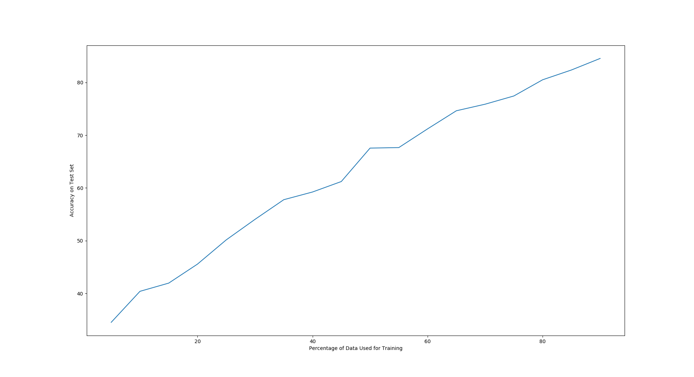

# Trend of the curve
The curve looks like this:

Between 5% and 95%, accuracy goes from 34% up to 85%.

# Noise
It seems a little noisier around the middle, probably because more things are flipping between training and testing.

# Number of trials for smooth curve
The graph above was run with 300 trials. It grows smoother with more iterations, but this shows the relationship well.

# C value
A high C value (10^-5) made the accuracy jump up to 95% at around 35% of the dataset used for training. It also run much slower on larger training sets. A low C value (10^-20) caused it to run faster, and created a much more linear relationship.
